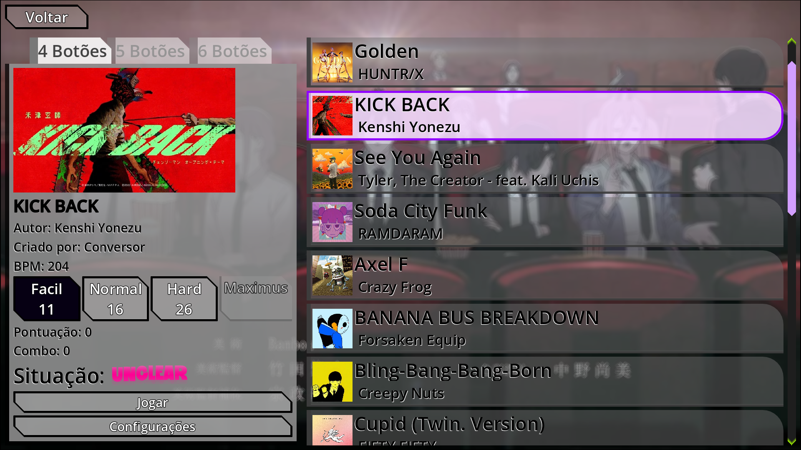
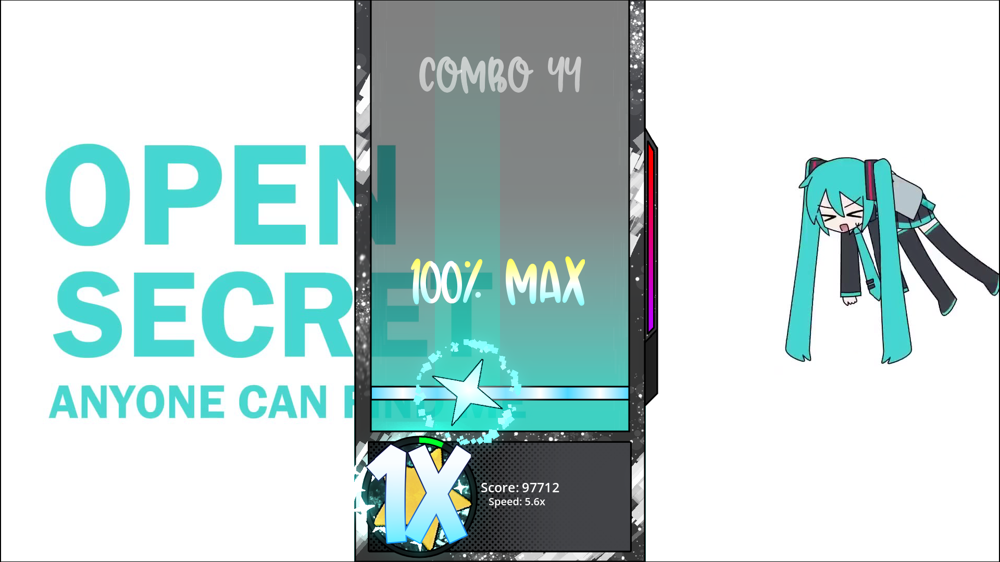
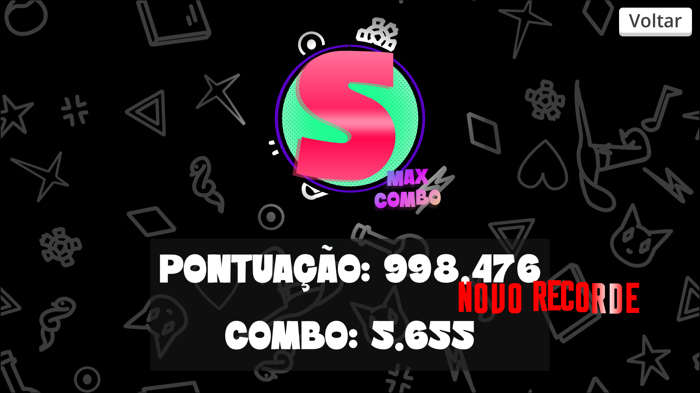
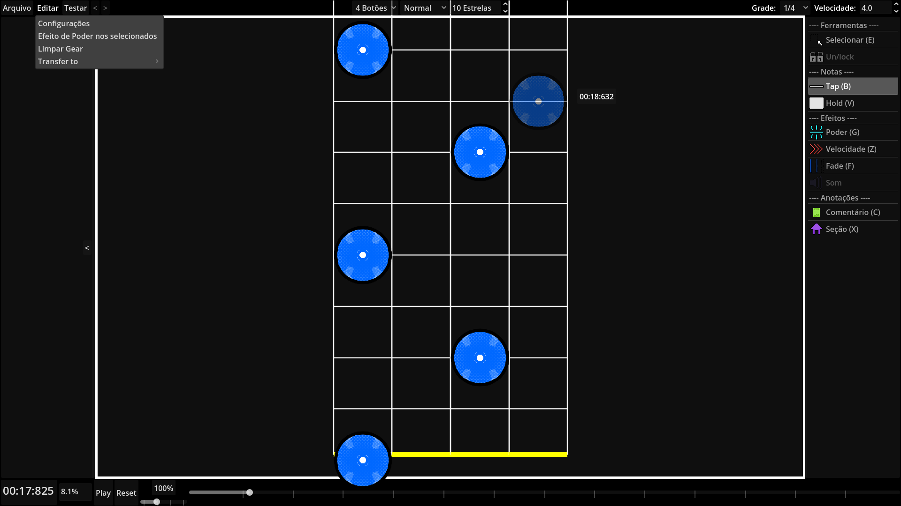

# June

# - Português
Um jogo de ritmo que você pode criar seus próprios mapas de música e compartilhar com qualquer pessoa.  
O jogo atualmente está em beta, as imagens a seguir não representam o produto final.

Tem uma seção onde você pode selecionar a música que você quer, a dificuldade e quantos botões.

June possui um sistema para recompensar aqueles que mantém um bom desempenho, em que, conforme você acerta as teclas sem errar,
 você entra no estado de Fever e, dependendo da sua precisão, você entra mais rápido, o Fever possui efeitos visuais de feedback na tela,
 além de aumentar o multiplicador do seu combo.

No final da música, você consegue ver os seus resultados.

Como foi dito no começo, você pode criar o seu próprio mapa de música, escolhendo as dificuldades, quantidades de estrelas, botões e outras mecânicas.
Além disso, nas configurações da música você pode escolher a imagem, o vídeo, etc.

# - English
A rhythm game where you can create your own song maps and share them with anyone.  
The game is currently in beta, the following images do not represent the final product.

There's a section where you can select the song you want, the difficulty level, and how many buttons to use.

June has a system to reward those who maintain good performance, in which, as you hit the keys without making a mistake,
you enter the Fever state and, depending on your accuracy, you enter it faster. Fever has visual feedback effects on the screen,
in addition to increasing the multiplier of your combo.

In the end of song, you can see the results.

As mentioned at the beginning, you can create your own music map, choosing the difficulty levels, number of stars, buttons, and other mechanics.
In addition, in the music settings you can choose the image, video, etc.

